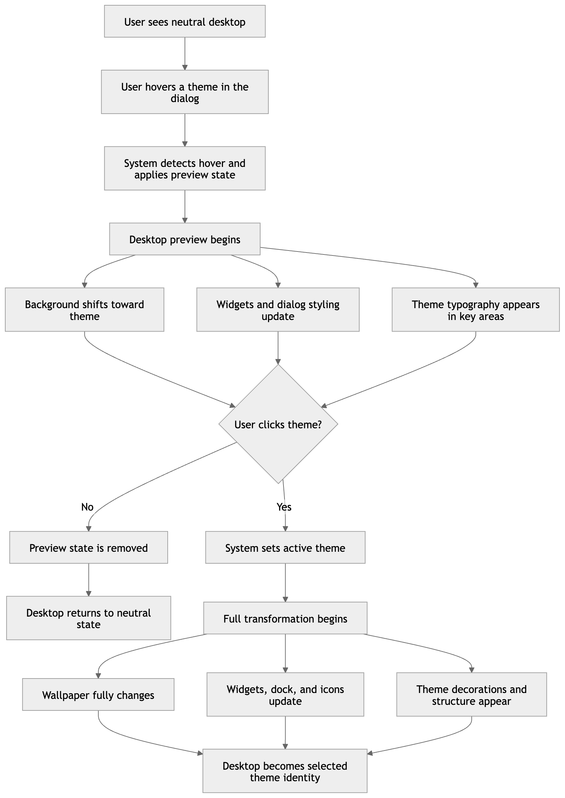

# Project Title

## Live URL

## Design Intent

---

### Overall Concept

A desktop operating system that begins in a neutral, default state and transforms into entirely different system identities through user interaction.

This is not a theme switcher.

Each theme represents a different world with its own behavior, structure, and atmosphere. The transformation must feel like the system is becoming something new — not simply updating its appearance.

The goal is for each applied state to feel like:
- a different OS
- running on different hardware
- with different environmental conditions

---

### Core Experience Principle — System Awakening

The system must feel like it is activating, not switching.

Every transformation must communicate:
- progression
- buildup
- arrival

At no point should the experience feel instantaneous or purely visual.

If a transition feels like a simple toggle, it is incorrect.

---

### Default State (Baseline System)

- Background: Light gray `#EDEEF0`
- Cards / panels: White `#FFFFFF` with soft shadows
- System accent: Blue `#2B6FED`
- Typography: Inter (system sans-serif)
- Dock: Clean, centered, minimal
- Atmosphere: None (no particles, no textures, no overlays)

This state represents a neutral system with no identity.

---

### Theme Identities (Visual + Structural + Behavioral)

---

#### Theme 1 — Post-Apocalyptic Nature

##### Visual Identity
Nature has overtaken the system. The interface still functions, but it is no longer pristine.

- Card surface: `#C8C4B0`
- Accent: `#4A7C59`
- Ambient: drifting spores (~15%)
- Lighting: soft, diffused, slightly hazy

##### Structural Behavior
- Organic elements intrude into the UI
- Vines overlap card edges and appear in corners
- Card edges feel slightly irregular or worn
- Layout loses perfect alignment (subtle asymmetry)

##### Interaction Behavior
- Hover has slight delay (~50–80ms)
- Transitions feel slower and heavier
- System feels aged and resistant, not responsive

##### Core Feeling
The system is being reclaimed by nature. It is no longer fully controlled.

---

#### Theme 2 — Divine / Heavenly

##### Visual Identity
The interface feels illuminated from within — soft, infinite, and elevated.

- Card surface: `#F9F3E3`
- Accent: `#C9A84C`
- Ambient: slow light rays (~20%)
- Lighting: warm gold and soft celestial blue

##### Structural Behavior
- Layout becomes more vertical and elevated
- Increased spacing between elements
- UI feels like it is floating rather than resting
- Strong symmetry and alignment

##### Interaction Behavior
- Smooth, continuous transitions
- No sharp motion — everything glides
- Hover fades instead of shifts

##### Core Feeling
The system is ascending. It feels calm, infinite, and weightless.

---

#### Theme 3 — Cyberpunk

##### Visual Identity
A dense, high-energy system powered by data and electricity.

- Card surface: `#0F0F1E`
- Accent: `#00FFFF` (primary) / `#FF2D78` (secondary)
- Ambient: rain + scanlines
- Lighting: neon reflections, high contrast

##### Structural Behavior
- UI becomes denser and more layered
- Widgets feel like independent modules
- Micro UI elements appear (data lines, small indicators)

##### Interaction Behavior
- Immediate response (no delay)
- Sharp transitions
- Subtle glitch or flicker feedback

##### Core Feeling
The system is overloaded with information. It feels fast, reactive, and alive.

---

### Typography System

| Theme | Signature Font |
|-------|----------------|
| Nature | Cormorant SC |
| Divine | Carattere |
| Cyberpunk | Aldrich |

Rules:
- Signature font is used only for headings and key visual moments
- System sans-serif (Inter) is used for all UI text
- Cyberpunk may use monospace for data

---

### Layout System (Layered Architecture)

1. Wallpaper
2. Ambient layer
3. Widget cards
4. File icons and labels
5. Dock
6. Theme dialog

Each layer transforms at different times to create depth.

---

### Hover Behavior (Preview State)

Hover is a partial awakening, not a full transformation.

- Wallpaper: 60–70% visible
- Cards: ~60% transformed
- Icons: begin shifting
- Ambient: 40–50% visible
- Dialog: begins adapting
- Typography: signature font appears immediately

- Duration: 600–800ms
- Easing: ease-in-out

Hover must be clearly noticeable from a distance.

---

### Click / Apply Behavior (Full Transformation)

- 0ms → Wallpaper completes
- 150ms → Ambient appears
- 300ms → Cards complete
- 450ms → Icons finalize
- 600ms → Decorative elements appear
- 800ms → Typography shifts
- 900ms → Dialog completes

The stagger is required to maintain depth.

---

### Ambient Layer Definition

Each theme includes a persistent environmental layer:

- Nature → drifting spores / dust
- Divine → slow light rays
- Cyberpunk → rain + scanlines

This layer creates cinematic depth and immersion.

---

### Non-Negotiable Rules

1. Default state is completely neutral
2. Each theme must feel like a different OS
3. No cross-theme contamination
4. Signature fonts are theme-exclusive
5. Dialog must remain readable
6. Decorative elements appear only on apply
7. Layer stagger must always exist
8. Hover is always weaker than apply

---

### Explicitly Rejected Solutions

The following are incorrect:

- Theme changes based only on color
- Hover affecting only a small component
- Standard settings-style UI
- Instant transformations
- Identical layout across all themes

---

### Evaluation Criteria

The design is successful if:

- Theme identity is recognizable within 1 second
- Hover state is clearly distinguishable from default
- The system feels like it transforms, not updates
- Each theme creates a distinct emotional experience
- Interaction feels layered and intentional

---

### Failure Cases

The design fails if:

- The system appears static during interaction
- All layers change simultaneously
- Themes differ only in color
- Hover is barely noticeable
- Interaction feels like a toggle

---

### Final Design Goal

This is not a UI theme.

This is a system that changes identity through interaction.

The user is not selecting a theme —
they are activating a different world.

## Mermaid Diagram

## AI Direction Log

### 1. Concept Direction — From Theme Switcher to System Transformation

**What I asked AI to do**
I asked for feedback on my initial idea, which was a desktop theme-switching interface.

**What AI produced**
AI suggested reframing the concept from a simple theme switcher into a "world transformation" system, where the interface itself changes identity.

**What I kept / changed / rejected**
I kept the idea of theme variation but changed the core concept into a transforming system rather than a settings-style switcher.

**Why**
The original idea felt too generic. The new direction made the project more immersive and aligned better with the assignment's emphasis on atmosphere and interaction.

---

### 2. Interaction Model — Hover as Preview, Click as Commitment

**What I asked AI to do**
I asked how to design interaction so the theme selection feels meaningful instead of functional.

**What AI produced**
AI proposed a two-stage interaction model:

* Hover = temporary preview
* Click = permanent commitment

**What I kept / changed / rejected**
I fully adopted this model without modification.

**Why**
This structure created a clear sense of progression and intention. It made the system feel responsive and interactive instead of behaving like a standard settings panel.

---

### 3. System Layout — Layered Desktop Structure

**What I asked AI to do**
I asked how to structure the interface so it feels like a real operating system but still supports transformation.

**What AI produced**
AI suggested organizing the UI into layers:
wallpaper → ambient → widgets → icons → dock → dialog

**What I kept / changed / rejected**
I kept the layered structure and applied it directly to my layout.

**Why**
This allowed the entire system to transform cohesively instead of having isolated UI changes. It also made it possible to control different elements independently in later stages.

---

### 4. Theme System Architecture — CSS Variable-Based System

**What I asked AI to do**
I asked for a scalable way to implement multiple themes without duplicating styles.

**What AI produced**
AI recommended using a CSS variable system where all visual properties are defined in `:root` and overridden through theme classes.

**What I kept / changed / rejected**
I kept this approach and implemented a full variable-based system. I avoided duplicating component styles inside theme classes.

**Why**
This made the system clean, maintainable, and scalable. It also ensured that applying a theme affects the entire interface consistently.

---

### 5. Interaction Implementation — Hover Preview and Click Selection

**What I asked AI to do**
I asked how to implement the interaction logic for hover preview and click-based theme selection.

**What AI produced**
AI suggested:

* Using JavaScript only for class switching
* Keeping all visual styling in CSS variables
* Managing a selected theme state for click behavior

**What I kept / changed / rejected**
I kept the structure and implemented both hover preview and click/apply logic using class switching on the `.desktop` element.

**Why**
This approach kept the system clean and scalable while maintaining separation between logic (JavaScript) and visuals (CSS). It also ensured the interaction behaves exactly as intended:

* Hover previews
* Click commits
* The system responds as a whole

---

## Records of Resistance

### Record of Resistance 1

**What AI produced:**
Claude generated a detailed Design Intent with color palettes, ambient effects (rain, spores, light rays), and decorative elements for each theme. The system structure remained consistent across all themes, with changes mainly in color, texture, and visual effects.

**Why I rejected or revised it:**
The design felt too predictable and surface-level. The themes relied on common visual tropes and did not fully achieve the goal of making each theme feel like a different system. More importantly, the layout and structure of the interface did not change, which made the experience feel like a simple theme switch rather than a transformation.

**What I did instead:**
I revised the design so that each theme also affects the structure of the interface, not just its appearance. Widget shapes, borders, and visual framing change depending on the theme, making each one feel like a distinct system identity.

---

### Record of Resistance 2

**What AI produced:**
Initial outputs focused on a standard three-panel theme selection layout, where each theme was displayed as an equal card.

**Why I rejected it:**
This felt too generic and similar to a typical UI component or settings menu. It did not match my goal of creating an immersive, system-level transformation experience.

**What I did instead:**
I changed the concept to a desktop environment where the theme selection affects the entire system. This allowed the interaction to feel more immersive and aligned with the idea of entering a different digital world.

---

### Record of Resistance 3

**What AI produced:**
The initial interaction focused on changing the theme only after clicking, with minimal hover feedback limited to the selection window.

**Why I rejected it:**
This did not meet the requirement for the interface to react on hover. It also made the experience feel static and less interactive.

**What I did instead:**
I redesigned the interaction so that hovering over a theme previews changes across the entire desktop, including background and UI elements. Clicking then applies the full transformation, creating a more responsive and immersive experience.

### Record of Resistance 4

**What AI produced:**
AI generated a refinement of the Overgrown Ruins theme by making subtle visual adjustments to the widgets, theme window, file icons, and dock. The changes included slight color tuning and minor stylistic tweaks, but the overall structure and appearance of the interface remained very similar to a standard modern UI.

**Why I rejected or revised it:**
The result was too subtle and did not achieve the goal of system-level transformation. The interface still looked like a clean UI placed on top of a background image rather than a fully immersive environment. This made the experience feel like a theme or skin instead of a transformed system, which goes against the design intent of "System Awakening." The AI output was technically correct but creatively weak and too safe.

**What I did instead:**
I rejected the output and provided more specific and stricter direction. I pushed for stronger visual changes in material, depth, and atmosphere while maintaining usability. I guided the AI to treat UI elements as physical surfaces by adding layered gradients, inner shadows, and tone shifts, and to make components like the theme window, dock, and widgets feel integrated into the environment rather than separate from it. This resulted in a more immersive and cohesive transformation across the interface.

---

## Five Questions Reflection
